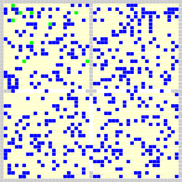

# abm-sir
Output of `abm-sir` as part of [`abm-x`](https://github.com/dudung/abm-x)

## Parameter
```
PARAMETR VALUE
SCENARIO 10
HEALTIME 14
ITERTIME 300
INFAGENT 0
RECAGENT 1,2,11,12,13,22,23,24
```

## City


```
ITR C0S C0I C0R C0N C1S C1I C1R C1N C2S C2I C2R C2N C3S C3I C3R C3N CAN
000 112 001 008 121 121 000 000 121 121 000 000 121 121 000 000 121 484
001 111 001 008 120 121 000 000 121 121 000 000 121 120 000 000 120 482
002 111 001 008 120 121 000 000 121 122 000 000 122 120 000 000 120 483
003 111 001 008 120 120 000 000 120 118 000 000 118 119 000 000 119 477
004 110 001 008 119 121 000 000 121 117 000 000 117 119 000 000 119 476
005 112 001 008 121 121 000 000 121 117 000 000 117 117 000 000 117 476
006 113 001 008 122 121 000 000 121 118 000 000 118 117 000 000 117 478
007 114 001 008 123 122 000 000 122 117 000 000 117 117 000 000 117 479
008 114 001 008 123 121 000 000 121 117 000 000 117 116 000 000 116 477
009 114 001 008 123 121 000 000 121 115 000 000 115 117 000 000 117 476
010 113 001 008 122 121 000 000 121 116 000 000 116 118 000 000 118 477
011 111 001 008 120 122 000 000 122 117 000 000 117 117 000 000 117 476
012 113 001 008 122 122 000 000 122 117 000 000 117 118 000 000 118 479
013 112 001 008 121 122 000 000 122 117 000 000 117 118 000 000 118 478
014 113 000 009 122 122 000 000 122 118 000 000 118 117 000 000 117 479
015 114 000 009 123 122 000 000 122 117 000 000 117 115 000 000 115 477
016 113 000 009 122 122 000 000 122 114 000 000 114 114 000 000 114 472
017 113 000 009 122 122 000 000 122 114 000 000 114 117 000 000 117 475
018 112 000 009 121 122 000 000 122 113 000 000 113 118 000 000 118 474
019 110 000 009 119 123 000 000 123 113 000 000 113 116 000 000 116 471
020 111 000 009 120 123 000 000 123 116 000 000 116 115 000 000 115 474
021 111 000 009 120 125 000 000 125 117 000 000 117 113 000 000 113 475
022 112 000 009 121 125 000 000 125 117 000 000 117 110 000 000 110 473
023 113 000 009 122 125 000 000 125 116 000 000 116 111 000 000 111 474
024 112 000 009 121 125 000 000 125 116 000 000 116 110 000 000 110 472
025 114 000 009 123 126 000 000 126 116 000 000 116 109 000 000 109 474
026 113 000 009 122 126 000 000 126 116 000 000 116 105 000 000 105 469
027 113 000 009 122 125 000 000 125 117 000 000 117 107 000 000 107 471
028 111 000 009 120 127 000 000 127 118 000 000 118 109 000 000 109 474
029 110 000 009 119 126 000 000 126 118 000 000 118 108 000 000 108 471
030 109 000 009 118 126 000 000 126 120 000 000 120 109 000 000 109 473
031 110 000 009 119 126 000 000 126 123 000 000 123 105 000 000 105 473
032 106 000 009 115 126 000 000 126 121 000 000 121 107 000 000 107 469
033 109 000 009 118 126 000 000 126 122 000 000 122 107 000 000 107 473
034 112 000 009 121 124 000 000 124 119 000 000 119 109 000 000 109 473
035 110 000 009 119 122 000 000 122 119 000 000 119 109 000 000 109 469
036 111 000 009 120 123 000 000 123 118 000 000 118 108 000 000 108 469
037 112 000 009 121 124 000 000 124 116 000 000 116 109 000 000 109 470
038 112 000 009 121 126 000 000 126 115 000 000 115 112 000 000 112 474
039 112 000 009 121 124 000 000 124 115 000 000 115 111 000 000 111 471
040 112 000 009 121 124 000 000 124 116 000 000 116 110 000 000 110 471
041 112 000 009 121 123 000 000 123 118 000 000 118 109 000 000 109 471
042 112 000 009 121 126 000 000 126 119 000 000 119 109 000 000 109 475
043 111 000 009 120 126 000 000 126 117 000 000 117 109 000 000 109 472
044 111 000 009 120 125 000 000 125 117 000 000 117 111 000 000 111 473
045 109 000 009 118 124 000 000 124 120 000 000 120 112 000 000 112 474
046 106 000 009 115 123 000 000 123 120 000 000 120 111 000 000 111 469
047 107 000 009 116 124 000 000 124 123 000 000 123 114 000 000 114 477
048 107 000 009 116 125 000 000 125 123 000 000 123 111 000 000 111 475
049 107 000 009 116 125 000 000 125 121 000 000 121 110 000 000 110 472
050 108 000 009 117 125 000 000 125 120 000 000 120 111 000 000 111 473
051 106 000 009 115 125 000 000 125 119 000 000 119 109 000 000 109 468
052 106 000 009 115 126 000 000 126 119 000 000 119 110 000 000 110 470
053 107 000 009 116 126 000 000 126 120 000 000 120 113 000 000 113 475
054 107 000 009 116 126 000 000 126 122 000 000 122 113 000 000 113 477
055 107 000 009 116 127 000 000 127 120 000 000 120 113 000 000 113 476
056 107 000 009 116 128 000 000 128 120 000 000 120 114 000 000 114 478
057 107 000 009 116 128 000 000 128 121 000 000 121 113 000 000 113 478
058 107 000 009 116 124 000 000 124 118 000 000 118 113 000 000 113 471
059 107 000 009 116 123 000 000 123 119 000 000 119 114 000 000 114 472
060 107 000 009 116 124 000 000 124 119 000 000 119 117 000 000 117 476
061 108 000 009 117 123 000 000 123 118 000 000 118 116 000 000 116 474
062 108 000 009 117 123 000 000 123 117 000 000 117 117 000 000 117 474
063 110 000 009 119 123 000 000 123 116 000 000 116 119 000 000 119 477
064 109 000 009 118 123 000 000 123 115 000 000 115 120 000 000 120 476
065 108 000 009 117 122 000 000 122 114 000 000 114 119 000 000 119 472
066 111 000 009 120 122 000 000 122 113 000 000 113 117 000 000 117 472
067 111 000 009 120 123 000 000 123 112 000 000 112 117 000 000 117 472
068 112 000 009 121 122 000 000 122 112 000 000 112 115 000 000 115 470
069 114 000 009 123 124 000 000 124 113 000 000 113 116 000 000 116 476
070 112 000 009 121 124 000 000 124 115 000 000 115 114 000 000 114 474
071 112 000 009 121 127 000 000 127 114 000 000 114 115 000 000 115 477
072 112 000 009 121 127 000 000 127 113 000 000 113 115 000 000 115 476
073 113 000 009 122 126 000 000 126 114 000 000 114 115 000 000 115 477
074 113 000 009 122 127 000 000 127 114 000 000 114 114 000 000 114 477
075 113 000 009 122 127 000 000 127 114 000 000 114 114 000 000 114 477
076 112 000 009 121 126 000 000 126 112 000 000 112 115 000 000 115 474
077 112 000 009 121 126 000 000 126 111 000 000 111 114 000 000 114 472
078 111 000 009 120 127 000 000 127 113 000 000 113 117 000 000 117 477
079 110 000 009 119 125 000 000 125 113 000 000 113 116 000 000 116 473
080 110 000 009 119 126 000 000 126 115 000 000 115 114 000 000 114 474
081 109 000 009 118 126 000 000 126 115 000 000 115 115 000 000 115 474
082 108 000 009 117 124 000 000 124 115 000 000 115 117 000 000 117 473
083 108 000 009 117 124 000 000 124 116 000 000 116 117 000 000 117 474
084 108 000 009 117 123 000 000 123 114 000 000 114 117 000 000 117 471
085 108 000 009 117 122 000 000 122 113 000 000 113 119 000 000 119 471
086 108 000 009 117 122 000 000 122 113 000 000 113 120 000 000 120 472
087 110 000 009 119 124 000 000 124 115 000 000 115 119 000 000 119 477
088 111 000 009 120 124 000 000 124 114 000 000 114 120 000 000 120 478
089 109 000 009 118 124 000 000 124 115 000 000 115 118 000 000 118 475
090 109 000 009 118 124 000 000 124 111 000 000 111 118 000 000 118 471
091 107 000 009 116 124 000 000 124 112 000 000 112 120 000 000 120 472
092 108 000 009 117 123 000 000 123 115 000 000 115 118 000 000 118 473
093 107 000 009 116 124 000 000 124 113 000 000 113 116 000 000 116 469
094 107 000 009 116 123 000 000 123 113 000 000 113 115 000 000 115 467
095 107 000 009 116 122 000 000 122 114 000 000 114 115 000 000 115 467
096 108 000 009 117 122 000 000 122 114 000 000 114 114 000 000 114 467
097 104 000 009 113 121 000 000 121 115 000 000 115 118 000 000 118 467
098 103 000 009 112 121 000 000 121 117 000 000 117 117 000 000 117 467
099 104 000 009 113 122 000 000 122 117 000 000 117 116 000 000 116 468
100 105 000 009 114 123 000 000 123 117 000 000 117 117 000 000 117 471
101 103 000 009 112 123 000 000 123 119 000 000 119 118 000 000 118 472
102 103 000 009 112 122 000 000 122 118 000 000 118 118 000 000 118 470
103 106 000 009 115 123 000 000 123 119 000 000 119 118 000 000 118 475
104 107 000 009 116 122 000 000 122 119 000 000 119 118 000 000 118 475
105 107 000 009 116 123 000 000 123 119 000 000 119 119 000 000 119 477
106 106 000 009 115 123 000 000 123 118 000 000 118 119 000 000 119 475
107 106 000 009 115 122 000 000 122 120 000 000 120 118 000 000 118 475
108 106 000 009 115 126 000 000 126 120 000 000 120 116 000 000 116 477
109 106 000 009 115 126 000 000 126 120 000 000 120 117 000 000 117 478
110 106 000 009 115 125 000 000 125 118 000 000 118 119 000 000 119 477
111 107 000 009 116 124 000 000 124 117 000 000 117 118 000 000 118 475
112 107 000 009 116 123 000 000 123 116 000 000 116 118 000 000 118 473
113 107 000 009 116 123 000 000 123 119 000 000 119 119 000 000 119 477
114 107 000 009 116 121 000 000 121 118 000 000 118 120 000 000 120 475
115 107 000 009 116 122 000 000 122 117 000 000 117 119 000 000 119 474
116 105 000 009 114 124 000 000 124 118 000 000 118 120 000 000 120 476
117 105 000 009 114 122 000 000 122 119 000 000 119 117 000 000 117 472
118 105 000 009 114 123 000 000 123 118 000 000 118 121 000 000 121 476
119 105 000 009 114 123 000 000 123 118 000 000 118 118 000 000 118 473
120 105 000 009 114 124 000 000 124 118 000 000 118 117 000 000 117 473
121 105 000 009 114 123 000 000 123 118 000 000 118 117 000 000 117 472
122 105 000 009 114 123 000 000 123 119 000 000 119 117 000 000 117 473
123 104 000 009 113 124 000 000 124 118 000 000 118 117 000 000 117 472
124 105 000 009 114 123 000 000 123 119 000 000 119 116 000 000 116 472
125 106 000 009 115 123 000 000 123 118 000 000 118 115 000 000 115 471
126 105 000 009 114 123 000 000 123 117 000 000 117 116 000 000 116 470
127 105 000 009 114 123 000 000 123 119 000 000 119 115 000 000 115 471
128 104 000 009 113 123 000 000 123 118 000 000 118 115 000 000 115 469
129 104 000 009 113 122 000 000 122 118 000 000 118 116 000 000 116 469
130 105 000 009 114 122 000 000 122 119 000 000 119 118 000 000 118 473
131 105 000 009 114 122 000 000 122 120 000 000 120 117 000 000 117 473
132 107 000 009 116 123 000 000 123 121 000 000 121 115 000 000 115 475
133 107 000 009 116 121 000 000 121 119 000 000 119 117 000 000 117 473
134 107 000 009 116 121 000 000 121 120 000 000 120 119 000 000 119 476
135 106 000 009 115 121 000 000 121 120 000 000 120 118 000 000 118 474
136 106 000 009 115 119 000 000 119 120 000 000 120 122 000 000 122 476
137 106 000 009 115 118 000 000 118 119 000 000 119 120 000 000 120 472
138 106 000 009 115 117 000 000 117 121 000 000 121 117 000 000 117 470
139 105 000 009 114 117 000 000 117 120 000 000 120 119 000 000 119 470
140 106 000 009 115 117 000 000 117 120 000 000 120 120 000 000 120 472
141 105 000 009 114 118 000 000 118 122 000 000 122 119 000 000 119 473
142 105 000 009 114 120 000 000 120 120 000 000 120 121 000 000 121 475
143 107 000 009 116 119 000 000 119 120 000 000 120 119 000 000 119 474
144 106 000 009 115 119 000 000 119 116 000 000 116 119 000 000 119 469
145 106 000 009 115 118 000 000 118 116 000 000 116 118 000 000 118 467
146 107 000 009 116 119 000 000 119 117 000 000 117 120 000 000 120 472
147 107 000 009 116 119 000 000 119 118 000 000 118 120 000 000 120 473
148 107 000 009 116 120 000 000 120 117 000 000 117 118 000 000 118 471
149 107 000 009 116 117 000 000 117 117 000 000 117 119 000 000 119 469
150 107 000 009 116 117 000 000 117 115 000 000 115 121 000 000 121 469
151 106 000 009 115 117 000 000 117 116 000 000 116 120 000 000 120 468
152 107 000 009 116 118 000 000 118 114 000 000 114 120 000 000 120 468
153 108 000 009 117 120 000 000 120 114 000 000 114 118 000 000 118 469
154 110 000 009 119 120 000 000 120 116 000 000 116 117 000 000 117 472
155 109 000 009 118 119 000 000 119 115 000 000 115 117 000 000 117 469
156 111 000 009 120 120 000 000 120 116 000 000 116 118 000 000 118 474
157 110 000 009 119 119 000 000 119 115 000 000 115 117 000 000 117 470
158 111 000 009 120 119 000 000 119 116 000 000 116 117 000 000 117 472
159 111 000 009 120 120 000 000 120 117 000 000 117 118 000 000 118 475
160 111 000 009 120 121 000 000 121 117 000 000 117 116 000 000 116 474
161 111 000 009 120 121 000 000 121 117 000 000 117 116 000 000 116 474
162 110 000 009 119 120 000 000 120 118 000 000 118 114 000 000 114 471
163 109 000 009 118 122 000 000 122 119 000 000 119 114 000 000 114 473
164 108 000 009 117 122 000 000 122 119 000 000 119 115 000 000 115 473
165 106 000 009 115 122 000 000 122 119 000 000 119 115 000 000 115 471
166 105 000 009 114 122 000 000 122 117 000 000 117 114 000 000 114 467
167 106 000 009 115 123 000 000 123 119 000 000 119 113 000 000 113 470
168 107 000 009 116 122 000 000 122 120 000 000 120 115 000 000 115 473
169 108 000 009 117 125 000 000 125 120 000 000 120 113 000 000 113 475
170 106 000 009 115 123 000 000 123 120 000 000 120 115 000 000 115 473
171 106 000 009 115 124 000 000 124 122 000 000 122 115 000 000 115 476
172 106 000 009 115 124 000 000 124 119 000 000 119 116 000 000 116 474
173 106 000 009 115 124 000 000 124 122 000 000 122 114 000 000 114 475
174 106 000 009 115 124 000 000 124 122 000 000 122 114 000 000 114 475
175 106 000 009 115 123 000 000 123 123 000 000 123 113 000 000 113 474
176 105 000 009 114 122 000 000 122 121 000 000 121 114 000 000 114 471
177 106 000 009 115 121 000 000 121 121 000 000 121 116 000 000 116 473
178 105 000 009 114 122 000 000 122 120 000 000 120 119 000 000 119 475
179 106 000 009 115 122 000 000 122 121 000 000 121 117 000 000 117 475
180 105 000 009 114 123 000 000 123 119 000 000 119 117 000 000 117 473
181 105 000 009 114 123 000 000 123 120 000 000 120 117 000 000 117 474
182 106 000 009 115 125 000 000 125 119 000 000 119 115 000 000 115 474
183 103 000 009 112 123 000 000 123 120 000 000 120 115 000 000 115 470
184 103 000 009 112 123 000 000 123 121 000 000 121 115 000 000 115 471
185 103 000 009 112 121 000 000 121 124 000 000 124 116 000 000 116 473
186 103 000 009 112 123 000 000 123 125 000 000 125 117 000 000 117 477
187 103 000 009 112 122 000 000 122 125 000 000 125 117 000 000 117 476
188 102 000 009 111 121 000 000 121 126 000 000 126 117 000 000 117 475
189 103 000 009 112 121 000 000 121 125 000 000 125 117 000 000 117 475
190 102 000 009 111 120 000 000 120 123 000 000 123 116 000 000 116 470
191 102 000 009 111 122 000 000 122 124 000 000 124 115 000 000 115 472
192 103 000 009 112 123 000 000 123 123 000 000 123 115 000 000 115 473
193 104 000 009 113 122 000 000 122 125 000 000 125 114 000 000 114 474
194 104 000 009 113 123 000 000 123 127 000 000 127 112 000 000 112 475
195 105 000 009 114 124 000 000 124 126 000 000 126 110 000 000 110 474
196 102 000 009 111 123 000 000 123 128 000 000 128 109 000 000 109 471
197 099 000 009 108 124 000 000 124 128 000 000 128 108 000 000 108 468
198 099 000 009 108 123 000 000 123 128 000 000 128 110 000 000 110 469
199 100 000 009 109 123 000 000 123 125 000 000 125 111 000 000 111 468
200 102 000 009 111 123 000 000 123 124 000 000 124 109 000 000 109 467
201 101 000 009 110 124 000 000 124 125 000 000 125 109 000 000 109 468
202 101 000 009 110 127 000 000 127 124 000 000 124 110 000 000 110 471
203 102 000 009 111 126 000 000 126 125 000 000 125 109 000 000 109 471
204 103 000 009 112 125 000 000 125 124 000 000 124 110 000 000 110 471
205 103 000 009 112 125 000 000 125 121 000 000 121 110 000 000 110 468
206 103 000 009 112 124 000 000 124 123 000 000 123 113 000 000 113 472
207 105 000 009 114 125 000 000 125 121 000 000 121 112 000 000 112 472
208 106 000 009 115 124 000 000 124 122 000 000 122 113 000 000 113 474
209 106 000 009 115 125 000 000 125 120 000 000 120 115 000 000 115 475
210 105 000 009 114 124 000 000 124 120 000 000 120 115 000 000 115 473
211 106 000 009 115 123 000 000 123 120 000 000 120 114 000 000 114 472
212 106 000 009 115 123 000 000 123 121 000 000 121 115 000 000 115 474
213 106 000 009 115 123 000 000 123 118 000 000 118 117 000 000 117 473
214 105 000 009 114 124 000 000 124 115 000 000 115 114 000 000 114 467
215 106 000 009 115 124 000 000 124 116 000 000 116 116 000 000 116 471
216 106 000 009 115 124 000 000 124 117 000 000 117 115 000 000 115 471
217 107 000 009 116 124 000 000 124 116 000 000 116 114 000 000 114 470
218 106 000 009 115 124 000 000 124 114 000 000 114 116 000 000 116 469
219 106 000 009 115 123 000 000 123 115 000 000 115 117 000 000 117 470
220 106 000 009 115 122 000 000 122 116 000 000 116 118 000 000 118 471
221 105 000 009 114 123 000 000 123 118 000 000 118 115 000 000 115 470
222 106 000 009 115 124 000 000 124 118 000 000 118 114 000 000 114 471
223 106 000 009 115 124 000 000 124 117 000 000 117 114 000 000 114 470
224 107 000 009 116 125 000 000 125 117 000 000 117 113 000 000 113 471
225 104 000 009 113 127 000 000 127 119 000 000 119 113 000 000 113 472
226 104 000 009 113 126 000 000 126 119 000 000 119 111 000 000 111 469
227 104 000 009 113 127 000 000 127 121 000 000 121 113 000 000 113 474
228 104 000 009 113 127 000 000 127 122 000 000 122 113 000 000 113 475
229 104 000 009 113 128 000 000 128 120 000 000 120 115 000 000 115 476
230 105 000 009 114 127 000 000 127 119 000 000 119 114 000 000 114 474
231 103 000 009 112 128 000 000 128 120 000 000 120 114 000 000 114 474
232 103 000 009 112 128 000 000 128 121 000 000 121 113 000 000 113 474
233 104 000 009 113 127 000 000 127 121 000 000 121 115 000 000 115 476
234 106 000 009 115 128 000 000 128 119 000 000 119 113 000 000 113 475
235 106 000 009 115 129 000 000 129 119 000 000 119 114 000 000 114 477
236 106 000 009 115 129 000 000 129 119 000 000 119 112 000 000 112 475
237 106 000 009 115 130 000 000 130 120 000 000 120 113 000 000 113 478
238 107 000 009 116 130 000 000 130 119 000 000 119 113 000 000 113 478
239 106 000 009 115 131 000 000 131 119 000 000 119 114 000 000 114 479
240 105 000 009 114 130 000 000 130 119 000 000 119 112 000 000 112 475
241 105 000 009 114 130 000 000 130 116 000 000 116 113 000 000 113 473
242 105 000 009 114 130 000 000 130 118 000 000 118 114 000 000 114 476
243 103 000 009 112 127 000 000 127 117 000 000 117 115 000 000 115 471
244 104 000 009 113 126 000 000 126 116 000 000 116 117 000 000 117 472
245 102 000 009 111 126 000 000 126 118 000 000 118 116 000 000 116 471
246 103 000 009 112 127 000 000 127 118 000 000 118 114 000 000 114 471
247 103 000 009 112 126 000 000 126 117 000 000 117 114 000 000 114 469
248 102 000 009 111 127 000 000 127 117 000 000 117 114 000 000 114 469
249 102 000 009 111 127 000 000 127 120 000 000 120 111 000 000 111 469
250 102 000 009 111 127 000 000 127 120 000 000 120 113 000 000 113 471
251 104 000 009 113 127 000 000 127 121 000 000 121 115 000 000 115 476
252 102 000 009 111 127 000 000 127 119 000 000 119 116 000 000 116 473
253 102 000 009 111 128 000 000 128 117 000 000 117 115 000 000 115 471
254 102 000 009 111 128 000 000 128 115 000 000 115 113 000 000 113 467
255 105 000 009 114 127 000 000 127 115 000 000 115 114 000 000 114 470
256 106 000 009 115 127 000 000 127 115 000 000 115 117 000 000 117 474
257 106 000 009 115 127 000 000 127 113 000 000 113 118 000 000 118 473
258 105 000 009 114 127 000 000 127 113 000 000 113 116 000 000 116 470
259 104 000 009 113 128 000 000 128 113 000 000 113 115 000 000 115 469
260 103 000 009 112 128 000 000 128 112 000 000 112 114 000 000 114 466
261 104 000 009 113 127 000 000 127 114 000 000 114 116 000 000 116 470
262 105 000 009 114 126 000 000 126 114 000 000 114 117 000 000 117 471
263 104 000 009 113 127 000 000 127 115 000 000 115 117 000 000 117 472
264 105 000 009 114 127 000 000 127 115 000 000 115 118 000 000 118 474
265 105 000 009 114 129 000 000 129 112 000 000 112 118 000 000 118 473
266 105 000 009 114 128 000 000 128 108 000 000 108 118 000 000 118 468
267 104 000 009 113 131 000 000 131 109 000 000 109 119 000 000 119 472
268 104 000 009 113 129 000 000 129 108 000 000 108 118 000 000 118 468
269 104 000 009 113 131 000 000 131 111 000 000 111 118 000 000 118 473
270 105 000 009 114 129 000 000 129 108 000 000 108 119 000 000 119 470
271 105 000 009 114 129 000 000 129 108 000 000 108 120 000 000 120 471
272 105 000 009 114 129 000 000 129 110 000 000 110 117 000 000 117 470
273 104 000 009 113 130 000 000 130 111 000 000 111 118 000 000 118 472
274 104 000 009 113 129 000 000 129 110 000 000 110 116 000 000 116 468
275 105 000 009 114 129 000 000 129 111 000 000 111 118 000 000 118 472
276 105 000 009 114 130 000 000 130 112 000 000 112 118 000 000 118 474
277 106 000 009 115 130 000 000 130 113 000 000 113 115 000 000 115 473
278 106 000 009 115 130 000 000 130 113 000 000 113 115 000 000 115 473
279 104 000 009 113 130 000 000 130 114 000 000 114 115 000 000 115 472
280 105 000 009 114 131 000 000 131 114 000 000 114 113 000 000 113 472
281 104 000 009 113 128 000 000 128 112 000 000 112 114 000 000 114 467
282 104 000 009 113 131 000 000 131 110 000 000 110 114 000 000 114 468
283 105 000 009 114 129 000 000 129 112 000 000 112 114 000 000 114 469
284 104 000 009 113 130 000 000 130 113 000 000 113 115 000 000 115 471
285 107 000 009 116 127 000 000 127 113 000 000 113 115 000 000 115 471
286 108 000 009 117 128 000 000 128 111 000 000 111 117 000 000 117 473
287 108 000 009 117 128 000 000 128 111 000 000 111 116 000 000 116 472
288 108 000 009 117 128 000 000 128 110 000 000 110 119 000 000 119 474
289 108 000 009 117 128 000 000 128 111 000 000 111 117 000 000 117 473
290 108 000 009 117 129 000 000 129 110 000 000 110 117 000 000 117 473
291 110 000 009 119 128 000 000 128 112 000 000 112 115 000 000 115 474
292 110 000 009 119 128 000 000 128 114 000 000 114 117 000 000 117 478
293 109 000 009 118 128 000 000 128 115 000 000 115 113 000 000 113 474
294 109 000 009 118 128 000 000 128 112 000 000 112 117 000 000 117 475
295 111 000 009 120 128 000 000 128 112 000 000 112 114 000 000 114 474
296 110 000 009 119 128 000 000 128 114 000 000 114 114 000 000 114 475
297 109 000 009 118 127 000 000 127 113 000 000 113 116 000 000 116 474
298 110 000 009 119 128 000 000 128 114 000 000 114 113 000 000 113 474
299 108 000 009 117 128 000 000 128 115 000 000 115 114 000 000 114 474
300 109 000 009 118 129 000 000 129 114 000 000 114 115 000 000 115 476
```

## Agent
```
AID SUS INF REC IBA HIS
000 000 000 014 000 000
001 000 000 000 001 001
002 000 000 000 002 002
003 000 -01 -01 -01 
004 000 -01 -01 -01 
005 000 -01 -01 -01 
006 000 -01 -01 -01 
007 000 -01 -01 -01 
008 000 -01 -01 -01 
009 000 -01 -01 -01 
010 000 -01 -01 -01 
011 000 000 000 011 011
012 000 000 000 012 012
013 000 000 000 013 013
014 000 -01 -01 -01 
015 000 -01 -01 -01 
016 000 -01 -01 -01 
017 000 -01 -01 -01 
018 000 -01 -01 -01 
019 000 -01 -01 -01 
020 000 -01 -01 -01 
021 000 -01 -01 -01 
022 000 000 000 022 022
023 000 000 000 023 023
024 000 000 000 024 024
025 000 -01 -01 -01 
026 000 -01 -01 -01 
027 000 -01 -01 -01 
028 000 -01 -01 -01 
029 000 -01 -01 -01 
030 000 -01 -01 -01 
031 000 -01 -01 -01 
032 000 -01 -01 -01 
033 000 -01 -01 -01 
034 000 -01 -01 -01 
035 000 -01 -01 -01 
036 000 -01 -01 -01 
037 000 -01 -01 -01 
038 000 -01 -01 -01 
039 000 -01 -01 -01 
040 000 -01 -01 -01 
041 000 -01 -01 -01 
042 000 -01 -01 -01 
043 000 -01 -01 -01 
044 000 -01 -01 -01 
045 000 -01 -01 -01 
046 000 -01 -01 -01 
047 000 -01 -01 -01 
048 000 -01 -01 -01 
049 000 -01 -01 -01 
050 000 -01 -01 -01 
051 000 -01 -01 -01 
052 000 -01 -01 -01 
053 000 -01 -01 -01 
054 000 -01 -01 -01 
055 000 -01 -01 -01 
056 000 -01 -01 -01 
057 000 -01 -01 -01 
058 000 -01 -01 -01 
059 000 -01 -01 -01 
060 000 -01 -01 -01 
061 000 -01 -01 -01 
062 000 -01 -01 -01 
063 000 -01 -01 -01 
064 000 -01 -01 -01 
065 000 -01 -01 -01 
066 000 -01 -01 -01 
067 000 -01 -01 -01 
068 000 -01 -01 -01 
069 000 -01 -01 -01 
070 000 -01 -01 -01 
071 000 -01 -01 -01 
072 000 -01 -01 -01 
073 000 -01 -01 -01 
074 000 -01 -01 -01 
075 000 -01 -01 -01 
076 000 -01 -01 -01 
077 000 -01 -01 -01 
078 000 -01 -01 -01 
079 000 -01 -01 -01 
080 000 -01 -01 -01 
081 000 -01 -01 -01 
082 000 -01 -01 -01 
083 000 -01 -01 -01 
084 000 -01 -01 -01 
085 000 -01 -01 -01 
086 000 -01 -01 -01 
087 000 -01 -01 -01 
088 000 -01 -01 -01 
089 000 -01 -01 -01 
090 000 -01 -01 -01 
091 000 -01 -01 -01 
092 000 -01 -01 -01 
093 000 -01 -01 -01 
094 000 -01 -01 -01 
095 000 -01 -01 -01 
096 000 -01 -01 -01 
097 000 -01 -01 -01 
098 000 -01 -01 -01 
099 000 -01 -01 -01 
100 000 -01 -01 -01 
101 000 -01 -01 -01 
102 000 -01 -01 -01 
103 000 -01 -01 -01 
104 000 -01 -01 -01 
105 000 -01 -01 -01 
106 000 -01 -01 -01 
107 000 -01 -01 -01 
108 000 -01 -01 -01 
109 000 -01 -01 -01 
110 000 -01 -01 -01 
111 000 -01 -01 -01 
112 000 -01 -01 -01 
113 000 -01 -01 -01 
114 000 -01 -01 -01 
115 000 -01 -01 -01 
116 000 -01 -01 -01 
117 000 -01 -01 -01 
118 000 -01 -01 -01 
119 000 -01 -01 -01 
120 000 -01 -01 -01 
121 000 -01 -01 -01 
122 000 -01 -01 -01 
123 000 -01 -01 -01 
124 000 -01 -01 -01 
125 000 -01 -01 -01 
126 000 -01 -01 -01 
127 000 -01 -01 -01 
128 000 -01 -01 -01 
129 000 -01 -01 -01 
130 000 -01 -01 -01 
131 000 -01 -01 -01 
132 000 -01 -01 -01 
133 000 -01 -01 -01 
134 000 -01 -01 -01 
135 000 -01 -01 -01 
136 000 -01 -01 -01 
137 000 -01 -01 -01 
138 000 -01 -01 -01 
139 000 -01 -01 -01 
140 000 -01 -01 -01 
141 000 -01 -01 -01 
142 000 -01 -01 -01 
143 000 -01 -01 -01 
144 000 -01 -01 -01 
145 000 -01 -01 -01 
146 000 -01 -01 -01 
147 000 -01 -01 -01 
148 000 -01 -01 -01 
149 000 -01 -01 -01 
150 000 -01 -01 -01 
151 000 -01 -01 -01 
152 000 -01 -01 -01 
153 000 -01 -01 -01 
154 000 -01 -01 -01 
155 000 -01 -01 -01 
156 000 -01 -01 -01 
157 000 -01 -01 -01 
158 000 -01 -01 -01 
159 000 -01 -01 -01 
160 000 -01 -01 -01 
161 000 -01 -01 -01 
162 000 -01 -01 -01 
163 000 -01 -01 -01 
164 000 -01 -01 -01 
165 000 -01 -01 -01 
166 000 -01 -01 -01 
167 000 -01 -01 -01 
168 000 -01 -01 -01 
169 000 -01 -01 -01 
170 000 -01 -01 -01 
171 000 -01 -01 -01 
172 000 -01 -01 -01 
173 000 -01 -01 -01 
174 000 -01 -01 -01 
175 000 -01 -01 -01 
176 000 -01 -01 -01 
177 000 -01 -01 -01 
178 000 -01 -01 -01 
179 000 -01 -01 -01 
180 000 -01 -01 -01 
181 000 -01 -01 -01 
182 000 -01 -01 -01 
183 000 -01 -01 -01 
184 000 -01 -01 -01 
185 000 -01 -01 -01 
186 000 -01 -01 -01 
187 000 -01 -01 -01 
188 000 -01 -01 -01 
189 000 -01 -01 -01 
190 000 -01 -01 -01 
191 000 -01 -01 -01 
192 000 -01 -01 -01 
193 000 -01 -01 -01 
194 000 -01 -01 -01 
195 000 -01 -01 -01 
196 000 -01 -01 -01 
197 000 -01 -01 -01 
198 000 -01 -01 -01 
199 000 -01 -01 -01 
200 000 -01 -01 -01 
201 000 -01 -01 -01 
202 000 -01 -01 -01 
203 000 -01 -01 -01 
204 000 -01 -01 -01 
205 000 -01 -01 -01 
206 000 -01 -01 -01 
207 000 -01 -01 -01 
208 000 -01 -01 -01 
209 000 -01 -01 -01 
210 000 -01 -01 -01 
211 000 -01 -01 -01 
212 000 -01 -01 -01 
213 000 -01 -01 -01 
214 000 -01 -01 -01 
215 000 -01 -01 -01 
216 000 -01 -01 -01 
217 000 -01 -01 -01 
218 000 -01 -01 -01 
219 000 -01 -01 -01 
220 000 -01 -01 -01 
221 000 -01 -01 -01 
222 000 -01 -01 -01 
223 000 -01 -01 -01 
224 000 -01 -01 -01 
225 000 -01 -01 -01 
226 000 -01 -01 -01 
227 000 -01 -01 -01 
228 000 -01 -01 -01 
229 000 -01 -01 -01 
230 000 -01 -01 -01 
231 000 -01 -01 -01 
232 000 -01 -01 -01 
233 000 -01 -01 -01 
234 000 -01 -01 -01 
235 000 -01 -01 -01 
236 000 -01 -01 -01 
237 000 -01 -01 -01 
238 000 -01 -01 -01 
239 000 -01 -01 -01 
240 000 -01 -01 -01 
241 000 -01 -01 -01 
242 000 -01 -01 -01 
243 000 -01 -01 -01 
244 000 -01 -01 -01 
245 000 -01 -01 -01 
246 000 -01 -01 -01 
247 000 -01 -01 -01 
248 000 -01 -01 -01 
249 000 -01 -01 -01 
250 000 -01 -01 -01 
251 000 -01 -01 -01 
252 000 -01 -01 -01 
253 000 -01 -01 -01 
254 000 -01 -01 -01 
255 000 -01 -01 -01 
256 000 -01 -01 -01 
257 000 -01 -01 -01 
258 000 -01 -01 -01 
259 000 -01 -01 -01 
260 000 -01 -01 -01 
261 000 -01 -01 -01 
262 000 -01 -01 -01 
263 000 -01 -01 -01 
264 000 -01 -01 -01 
265 000 -01 -01 -01 
266 000 -01 -01 -01 
267 000 -01 -01 -01 
268 000 -01 -01 -01 
269 000 -01 -01 -01 
270 000 -01 -01 -01 
271 000 -01 -01 -01 
272 000 -01 -01 -01 
273 000 -01 -01 -01 
274 000 -01 -01 -01 
275 000 -01 -01 -01 
276 000 -01 -01 -01 
277 000 -01 -01 -01 
278 000 -01 -01 -01 
279 000 -01 -01 -01 
280 000 -01 -01 -01 
281 000 -01 -01 -01 
282 000 -01 -01 -01 
283 000 -01 -01 -01 
284 000 -01 -01 -01 
285 000 -01 -01 -01 
286 000 -01 -01 -01 
287 000 -01 -01 -01 
288 000 -01 -01 -01 
289 000 -01 -01 -01 
290 000 -01 -01 -01 
291 000 -01 -01 -01 
292 000 -01 -01 -01 
293 000 -01 -01 -01 
294 000 -01 -01 -01 
295 000 -01 -01 -01 
296 000 -01 -01 -01 
297 000 -01 -01 -01 
298 000 -01 -01 -01 
299 000 -01 -01 -01 
300 000 -01 -01 -01 
301 000 -01 -01 -01 
302 000 -01 -01 -01 
303 000 -01 -01 -01 
304 000 -01 -01 -01 
305 000 -01 -01 -01 
306 000 -01 -01 -01 
307 000 -01 -01 -01 
308 000 -01 -01 -01 
309 000 -01 -01 -01 
310 000 -01 -01 -01 
311 000 -01 -01 -01 
312 000 -01 -01 -01 
313 000 -01 -01 -01 
314 000 -01 -01 -01 
315 000 -01 -01 -01 
316 000 -01 -01 -01 
317 000 -01 -01 -01 
318 000 -01 -01 -01 
319 000 -01 -01 -01 
320 000 -01 -01 -01 
321 000 -01 -01 -01 
322 000 -01 -01 -01 
323 000 -01 -01 -01 
324 000 -01 -01 -01 
325 000 -01 -01 -01 
326 000 -01 -01 -01 
327 000 -01 -01 -01 
328 000 -01 -01 -01 
329 000 -01 -01 -01 
330 000 -01 -01 -01 
331 000 -01 -01 -01 
332 000 -01 -01 -01 
333 000 -01 -01 -01 
334 000 -01 -01 -01 
335 000 -01 -01 -01 
336 000 -01 -01 -01 
337 000 -01 -01 -01 
338 000 -01 -01 -01 
339 000 -01 -01 -01 
340 000 -01 -01 -01 
341 000 -01 -01 -01 
342 000 -01 -01 -01 
343 000 -01 -01 -01 
344 000 -01 -01 -01 
345 000 -01 -01 -01 
346 000 -01 -01 -01 
347 000 -01 -01 -01 
348 000 -01 -01 -01 
349 000 -01 -01 -01 
350 000 -01 -01 -01 
351 000 -01 -01 -01 
352 000 -01 -01 -01 
353 000 -01 -01 -01 
354 000 -01 -01 -01 
355 000 -01 -01 -01 
356 000 -01 -01 -01 
357 000 -01 -01 -01 
358 000 -01 -01 -01 
359 000 -01 -01 -01 
360 000 -01 -01 -01 
361 000 -01 -01 -01 
362 000 -01 -01 -01 
363 000 -01 -01 -01 
364 000 -01 -01 -01 
365 000 -01 -01 -01 
366 000 -01 -01 -01 
367 000 -01 -01 -01 
368 000 -01 -01 -01 
369 000 -01 -01 -01 
370 000 -01 -01 -01 
371 000 -01 -01 -01 
372 000 -01 -01 -01 
373 000 -01 -01 -01 
374 000 -01 -01 -01 
375 000 -01 -01 -01 
376 000 -01 -01 -01 
377 000 -01 -01 -01 
378 000 -01 -01 -01 
379 000 -01 -01 -01 
380 000 -01 -01 -01 
381 000 -01 -01 -01 
382 000 -01 -01 -01 
383 000 -01 -01 -01 
384 000 -01 -01 -01 
385 000 -01 -01 -01 
386 000 -01 -01 -01 
387 000 -01 -01 -01 
388 000 -01 -01 -01 
389 000 -01 -01 -01 
390 000 -01 -01 -01 
391 000 -01 -01 -01 
392 000 -01 -01 -01 
393 000 -01 -01 -01 
394 000 -01 -01 -01 
395 000 -01 -01 -01 
396 000 -01 -01 -01 
397 000 -01 -01 -01 
398 000 -01 -01 -01 
399 000 -01 -01 -01 
400 000 -01 -01 -01 
401 000 -01 -01 -01 
402 000 -01 -01 -01 
403 000 -01 -01 -01 
404 000 -01 -01 -01 
405 000 -01 -01 -01 
406 000 -01 -01 -01 
407 000 -01 -01 -01 
408 000 -01 -01 -01 
409 000 -01 -01 -01 
410 000 -01 -01 -01 
411 000 -01 -01 -01 
412 000 -01 -01 -01 
413 000 -01 -01 -01 
414 000 -01 -01 -01 
415 000 -01 -01 -01 
416 000 -01 -01 -01 
417 000 -01 -01 -01 
418 000 -01 -01 -01 
419 000 -01 -01 -01 
420 000 -01 -01 -01 
421 000 -01 -01 -01 
422 000 -01 -01 -01 
423 000 -01 -01 -01 
424 000 -01 -01 -01 
425 000 -01 -01 -01 
426 000 -01 -01 -01 
427 000 -01 -01 -01 
428 000 -01 -01 -01 
429 000 -01 -01 -01 
430 000 -01 -01 -01 
431 000 -01 -01 -01 
432 000 -01 -01 -01 
433 000 -01 -01 -01 
434 000 -01 -01 -01 
435 000 -01 -01 -01 
436 000 -01 -01 -01 
437 000 -01 -01 -01 
438 000 -01 -01 -01 
439 000 -01 -01 -01 
440 000 -01 -01 -01 
441 000 -01 -01 -01 
442 000 -01 -01 -01 
443 000 -01 -01 -01 
444 000 -01 -01 -01 
445 000 -01 -01 -01 
446 000 -01 -01 -01 
447 000 -01 -01 -01 
448 000 -01 -01 -01 
449 000 -01 -01 -01 
450 000 -01 -01 -01 
451 000 -01 -01 -01 
452 000 -01 -01 -01 
453 000 -01 -01 -01 
454 000 -01 -01 -01 
455 000 -01 -01 -01 
456 000 -01 -01 -01 
457 000 -01 -01 -01 
458 000 -01 -01 -01 
459 000 -01 -01 -01 
460 000 -01 -01 -01 
461 000 -01 -01 -01 
462 000 -01 -01 -01 
463 000 -01 -01 -01 
464 000 -01 -01 -01 
465 000 -01 -01 -01 
466 000 -01 -01 -01 
467 000 -01 -01 -01 
468 000 -01 -01 -01 
469 000 -01 -01 -01 
470 000 -01 -01 -01 
471 000 -01 -01 -01 
472 000 -01 -01 -01 
473 000 -01 -01 -01 
474 000 -01 -01 -01 
475 000 -01 -01 -01 
476 000 -01 -01 -01 
477 000 -01 -01 -01 
478 000 -01 -01 -01 
479 000 -01 -01 -01 
480 000 -01 -01 -01 
481 000 -01 -01 -01 
482 000 -01 -01 -01 
483 000 -01 -01 -01 
```

## Note
Created on 2020-06-13 23:12:49